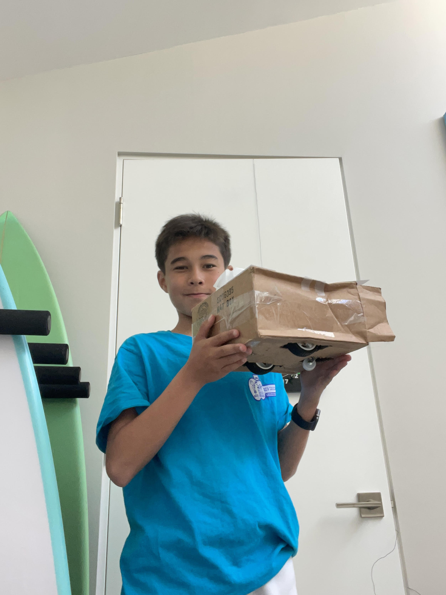

# Prank Tissue Box Car
My project is the Prank Tissue Box. This project is a car that you can use to prank your friends and family. When someone tries to go to grab a tissue, the car will move away from you.
| **Engineer** | **School** | **Area of Interest** | **Grade** |
|:--:|:--:|:--:|:--:|
| Beckett C | The Bishops School | Electrical Engineering | Incoming Freshman

**Replace the BlueStamp logo below with an image of yourself and your completed project. Follow the guide [here](https://tomcam.github.io/least-github-pages/adding-images-github-pages-site.html) if you need help.**


  
# Final Milestone
For your final milestone, explain the outcome of your project. Key details to include are:
- What you've accomplished since your previous milestone
- What your biggest challenges and triumphs were at BSE
- A summary of key topics you learned about
- What you hope to learn in the future after everything you've learned at BSE

**Don't forget to replace the text below with the embedding for your milestone video. Go to Youtube, click Share -> Embed, and copy and paste the code to replace what's below.**

<iframe width="560" height="315" src="https://www.youtube.com/embed/F7M7imOVGug" title="YouTube video player" frameborder="0" allow="accelerometer; autoplay; clipboard-write; encrypted-media; gyroscope; picture-in-picture; web-share" allowfullscreen></iframe>

# Second Milestone
For my second milestone, I completed my base project, the prank tissue box. For my design, I placed my rover in a cardboard box and cut out holes for the wheels. I created a hole in the top for a tissue, and covered it with cardboard on every side except for one. On that one side, I put the ultrasonic sensor, which detects the distance from an object using sound, in the cardboard. This way, whenever someone goes to grab a tissue, the ultrasonic sensor senses their hand and tells the rover to move forward, away from the grasping hand. While I was working through this, I found that the ultrasonic sensor sometimes wasn't sensing my hand. I looked through the code and discovered that the distance was set to too close. I changed the distance variable that says how far away an object must be, and the ultrasonic sensor began to sense my hand from farther away. Another difficulty that I encountered was trying to fit an entire tissue box into my cardboard box. Afterr struggling to figure out a way to fix this for a solid hour and a half, I decided to just ditch the tissue box, and put a single tissue in a cardboard box. For my final milesone, I want to add a speaker modification that plays a sound everytime someones hand passes over the ultrasonic sensor.

**Don't forget to replace the text below with the embedding for your milestone video. Go to Youtube, click Share -> Embed, and copy and paste the code to replace what's below.**

<iframe width="560" height="315" src="https://www.youtube.com/embed/y3VAmNlER5Y" title="YouTube video player" frameborder="0" allow="accelerometer; autoplay; clipboard-write; encrypted-media; gyroscope; picture-in-picture; web-share" allowfullscreen></iframe>

# First Milestone
My first milestone is the completion of the basic car. It is able to move forward, backwards, and turn. The car recieves code from my computer through the arduino, or the brain of the car. The arduino then relays this to the motor driver, which is connected to the motors and tells the motors to spin, allowing the car to move. I faced no major challenges except for some wiring issues, which were easily fixed. For the second milestone, I would like to have fully completed the base project.  

**Don't forget to replace the text below with the embedding for your milestone video. Go to Youtube, click Share -> Embed, and copy and paste the code to replace what's below.**

<iframe width="560" height="315" src="https://www.youtube.com/embed/CaCazFBhYKs" title="YouTube video player" frameborder="0" allow="accelerometer; autoplay; clipboard-write; encrypted-media; gyroscope; picture-in-picture; web-share" allowfullscreen></iframe>

# Schematics 
Here's where you'll put images of your schematics. [Tinkercad](https://www.tinkercad.com/blog/official-guide-to-tinkercad-circuits) and [Fritzing](https://fritzing.org/learning/) are both great resoruces to create professional schematic diagrams, though BSE recommends Tinkercad becuase it can be done easily and for free in the browser. 
unnamed.jpg
# Code
Here's where you'll put your code. The syntax below places it into a block of code. Follow the guide [here]([url](https://www.markdownguide.org/extended-syntax/)) to learn how to customize it to your project needs. 

```c++
void setup() {
  // put your setup code here, to run once:
  Serial.begin(9600);
  Serial.println("Hello World!");
}

void loop() {
  // put your main code here, to run repeatedly:

}
```

# Bill of Materials
Here's where you'll list the parts in your project. To add more rows, just copy and paste the example rows below.
Don't forget to place the link of where to buy each component inside the quotation marks in the corresponding row after href =. Follow the guide [here]([url](https://www.markdownguide.org/extended-syntax/)) to learn how to customize this to your project needs. 

| **Part** | **Note** | **Price** | **Link** |

          | Prank Tissue Box | ELEGOO UNO Project Super Starter Kit with Tutorial and UNO R3 Compatible with Arduino IDE | $44.99 | <a href=https://www.amazon.com/ELEGOO-Project-Tutorial-Controller-Projects/dp/B01D8KOZF4/ref=sr_1_1_sspa?crid=CC9E3AEUR0FV&keywords=sunfounder+3+in+1+starter+kit+for+arduino+uno&qid=1687551712&sprefix=3+in+1+sunfounder%2Caps%2C170&sr=8-1-spons&sp_csd=d2lkZ2V0TmFtZT1zcF9hdGY&psc=1> Link </a> |
|:--:|:--:|:--:|:--:|
| Item Name | What the item is used for | $Price | <a href="https://www.amazon.com/Arduino-A000066-ARDUINO-UNO-R3/dp/B008GRTSV6/"> Link </a> |
|:--:|:--:|:--:|:--:|
| Item Name | What the item is used for | $Price | <a href="https://www.amazon.com/Arduino-A000066-ARDUINO-UNO-R3/dp/B008GRTSV6/"> Link </a> |
|:--:|:--:|:--:|:--:|

# Other Resources/Examples
One of the best parts about Github is that you can view how other people set up their own work. Here are some past BSE portfolios that are awesome examples. You can view how they set up their portfolio, and you can view their index.md files to understand how they implemented different portfolio components.
- [Example 1](https://trashytuber.github.io/YimingJiaBlueStamp/)
- [Example 2](https://sviatil0.github.io/Sviatoslav_BSE/)
- [Example 3](https://arneshkumar.github.io/arneshbluestamp/)

To watch the BSE tutorial on how to create a portfolio, click here.
